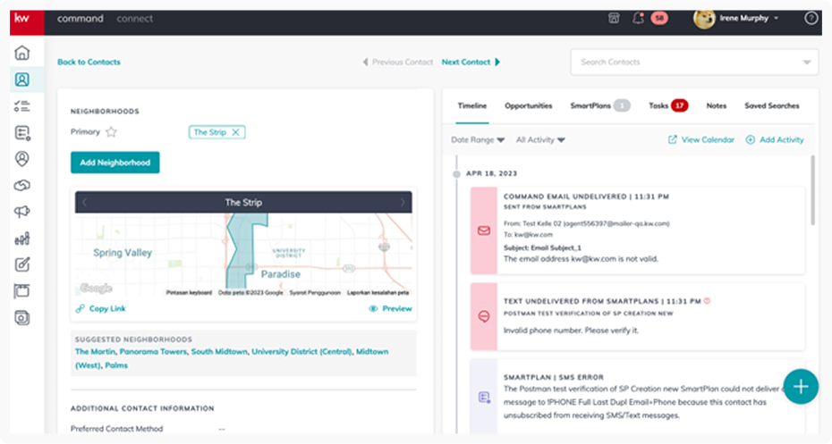
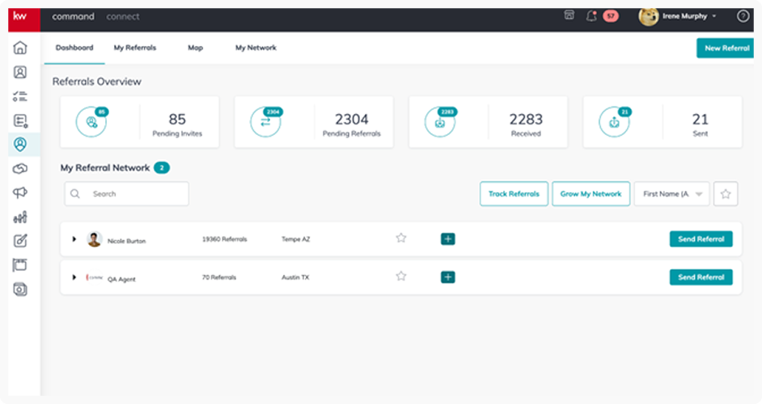
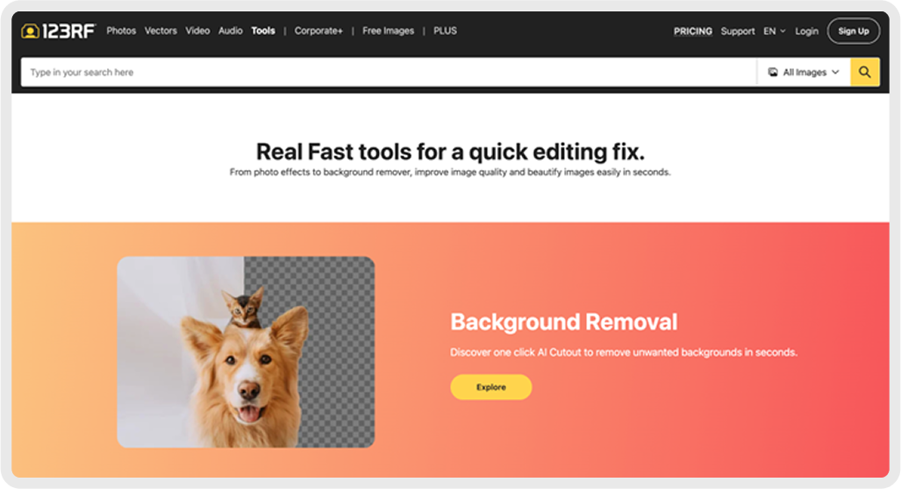

# Project List

## Portal Sekolah

**Company:** Noble Software / Visiprima  
**Role:** Lead Frontend Developer  
**Duration:** 2019 - Present  

### Stack
- Javascript
- Typescript
- React (Nextjs)
- Redux environment (Redux Toolkit, React-redux)
- Jest, React Testing Library
- Storybook
- CI/CD
- SASS (CSS Preprocessor)
- Ionic Framework

### Description
I take over an important role in this company, not only as a Frontend Developer but also as a Lead Frontend here. My responsibility is to ensure that the FE team can deliver quality results and produce maintainable and readable code. Additionally, I provide training and guidance to help my team grow. My task also involves ensuring that what is provided by stakeholders can be implemented according to the team's abilities and capabilities. Here, I also assist the UI/UX team and the QA team in providing input to their teams on how to contribute between teams. Being a Lead is not easy in my opinion because it requires precision, patience, and good abilities to balance everything. Since joining this company, I have successfully guided all IT teams (Engineers, PMs, QAs, Designers, etc.) to implement Agile Methodology and use JIRA as a tool for team management effectively and correctly. Previously, they were using Agile Methodology but the implementation was far from the Agile concept itself.

### Project Screenshot

### Project Details
Portal Sekolah has been available since 2019 and has been used by dozens of schools across Indonesia. Initially, this project was handled by a team from India, and after I joined the team, I successfully improved several code flows, refactored code in dozens of features and components, where the flow was very messy and bugs often occurred, even in production. This required high precision because the refactoring had to ensure that the issues encountered were fixed without causing other issues. With my experience in education and finance, I also provided some inputs to stakeholders and project managers regarding changes in the flow, which ultimately improved the user experience.

### Key Achievements
- Successfully refactored and improved code flows in dozens of features and components
- Fixed production bugs and improved overall system stability
- Implemented Agile Methodology across all IT teams
- Introduced JIRA as an effective team management tool
- Provided guidance and training to frontend team members
- Collaborated with UI/UX and QA teams for better cross-team coordination
- Improved user experience through stakeholder and project manager consultation

---

## Portal Kerja

**Company:** Noble Software / Visiprima  
**Role:** Lead Frontend Developer  
**Duration:** 2022 - Present  

### Stack
- Javascript
- Typescript
- React (Nextjs)
- Redux environment (Redux Toolkit, React-redux)
- Jest, React Testing Library
- Storybook
- CI/CD
- SASS (CSS Preprocessor)
- Atomic Component Design

### Description
Portal Kerja is a job search application developed from scratch, improving upon previously implemented inputs. The development emphasizes an "atomic component concept" for reusability and provides inputs applicable to all features for the PM team's planning. Research was conducted to ensure easy implementation of PM-planned features from the Front-End (FE) side, with a focus on good quality and readability of the FE code.

### Project Screenshot

### Project Details
Portal Kerja is a comprehensive job search platform that helps job seekers find their dream positions while providing companies with an efficient way to post job openings. The application features a modern, user-friendly interface with advanced search capabilities, allowing users to search by position, company, and location. The platform includes features for both job seekers and employers, with separate interfaces for each user type.

### Key Features
- Advanced job search functionality with filters
- User authentication and registration system
- Company portal for job posting
- Responsive design for all devices
- Real-time job matching and recommendations
- Application tracking system

### Key Achievements
- Developed from scratch using atomic component architecture
- Implemented reusable component system for better maintainability
- Created comprehensive component library for consistent UI/UX
- Established development patterns for PM team collaboration
- Ensured high code quality and readability standards
- Optimized performance for large-scale job listings

---

## Portal Kampus

**Company:** Noble Software / Visiprima  
**Role:** Lead Frontend Developer & Scrum Master  
**Duration:** 2023 - Present  

### Stack
- Javascript
- Typescript
- React (Nextjs)
- Redux environment (Redux Toolkit, React-redux)
- Jest, React Testing Library
- Storybook
- CI/CD
- SASS (CSS Preprocessor)
- Agile/Scrum Methodology

### Description
Portal Kampus is a new project developed from scratch, involving parallel work with the Product Manager (PM) for feature planning. A key challenge is adapting to PM-directed changes during development. My role extends beyond being a Front-End (FE) developer to also being a Lead FE (ensuring good code delivery) and a Scrum Master (structuring PM plans, preventing disruption to the engineering team across FE, BE, Android, and iOS). The goal is to provide code quality from the FE team and facilitate smooth development flow as a Scrum Master to achieve development goals without inter-team interference and maximize collaboration.

### Project Screenshot

### Project Details
Portal Kampus is a comprehensive campus management system designed for educational institutions. The platform provides students, faculty, and administrators with tools for academic management, including course scheduling, assessment tracking, forum discussions, and campus announcements. The system features a modern dashboard with calendar integration, assessment management, and collaborative forum features.

### Key Features
- Student dashboard with academic overview
- Course scheduling and timetable management
- Assessment and assignment tracking
- Campus forum for student discussions
- Announcement system for campus updates
- Calendar integration for academic events
- Notification system for important updates
- Academic year management

### Key Achievements
- Successfully managed dual role as Lead FE and Scrum Master
- Implemented Agile methodology across cross-functional teams
- Coordinated development between FE, BE, Android, and iOS teams
- Established effective communication channels between PM and engineering teams
- Created scalable architecture for campus management system
- Delivered high-quality code while managing team dynamics
- Facilitated smooth development flow without inter-team interference

---

## Feature Flag Management System

**Company:** Noble Software / Visiprima  
**Role:** Lead Frontend Developer  
**Duration:** 2023 - Present  

### Stack
- Javascript
- Typescript
- React (Nextjs)
- Redux environment (Redux Toolkit, React-redux)
- Jest, React Testing Library
- Storybook
- CI/CD
- SASS (CSS Preprocessor)
- Feature Flag Architecture

### Description
Feature flags are an initiative to prevent unfinished or untested code from appearing in production. They help manage features that are not yet ready for deployment, saving development time and ensuring controlled changes. The system provides comprehensive control over feature visibility across different environments (Staging, UAT, Production) with detailed tracking and management capabilities.

### Project Screenshot

### Project Details
The Feature Flag Management System is a comprehensive dashboard that allows teams to control feature visibility across multiple environments. The system provides granular control over feature deployment, enabling safe rollouts and quick rollbacks when needed. It integrates with JIRA for ticket tracking and provides detailed audit trails for all feature flag changes.

### Key Features
- Multi-environment feature flag control (Staging, UAT, Production)
- JIRA integration for ticket tracking
- Detailed audit trails and history tracking
- Bulk operations for multiple flags
- Environment-specific visibility controls
- Search and filtering capabilities
- User-friendly dashboard interface
- Real-time flag status updates

### Key Achievements
- Implemented comprehensive feature flag architecture
- Created intuitive dashboard for flag management
- Integrated with existing JIRA workflow
- Established environment-specific deployment controls
- Reduced production deployment risks
- Improved development workflow efficiency
- Enhanced team collaboration through centralized flag management

---

## Subscription Flag Features (V2)

**Company:** Noble Software / Visiprima  
**Role:** Lead Frontend Developer  
**Duration:** 2024 - Present  

### Stack
- Javascript
- Typescript
- React (Nextjs)
- Redux environment (Redux Toolkit, React-redux)
- Jest, React Testing Library
- Storybook
- CI/CD
- SASS (CSS Preprocessor)
- Subscription Management Architecture

### Description
A comprehensive four-tier subscription management system developed for "Portal Sekolah" supporting Free, Standard, Premium, and Premium Plus models. The system emphasizes flexibility in managing product strategy, dynamically controlling subscription packages and add-on features, and mapping packages to schools. Key features include strict access control based on subscription levels, business validation, real-time access control via feature flags, school mapping with history tracking, an add-ons system, complete audit trails, playground simulation for testing, and a responsive interface.

### Project Screenshot

### Project Details
The Subscription Flag Features (V2) system is a sophisticated subscription management platform that provides complete control over product strategy and feature access. The system supports multiple subscription tiers with dynamic feature control, comprehensive audit trails, and real-time access management. It includes a playground environment for testing subscription scenarios and provides detailed analytics for subscription management.

### Key Features
- Four-tier subscription system (Free, Standard, Premium, Premium Plus)
- Dynamic feature flag control based on subscription levels
- School mapping and subscription management
- Add-ons system (SPMB, Counseling, School Fee)
- Complete audit trails and history tracking
- Playground simulation for testing scenarios
- Real-time access control via feature flags
- Business validation and access control
- Responsive interface design
- Comprehensive analytics dashboard

### Key Achievements
- Successfully implemented complex subscription management system
- Created flexible product strategy control mechanisms
- Developed comprehensive audit trail system
- Established real-time access control architecture
- Built playground environment for testing scenarios
- Improved operational efficiency through automation
- Enhanced user experience with responsive design
- Provided complete control over product strategy
- Ensured consistent user experience across subscription tiers

---

## Scrum Master Volunteer (Freelance)

**Company:** VPN  
**Role:** Scrum Master Volunteer (Freelance)  
**Duration:** 2023 - 2024  

### Stack
- Trello (Legacy System)
- JIRA (Migration Target)
- Scrum Methodology
- Agile Project Management
- Team Training & Development

### Description
The company initially used Trello for task tracking, but it became overwhelming, lacked structure, and tasks had unclear statuses. There was a limitation of only 10 free Trello accounts. I suggested updating statuses in Trello and JIRA, and subsequently decided to migrate all tasks from Trello to JIRA, exploring ways to share the limited 10 free JIRA accounts across various roles. Through strategic efforts and support from the Engineering Manager, access to JIRA's standard premium features was obtained, allowing all engineers to be invited using their individual accounts. Many engineers were unfamiliar with Scrum methodology or JIRA, so I undertook efforts to train and familiarize the team with Scrum principles (e.g., self-organization, empiricism) and effective JIRA usage.

### Project Screenshots

#### Before: Trello Management

#### After: JIRA Implementation

### Project Details
This project involved a complete transformation of the company's project management approach from an unstructured Trello-based system to a professional JIRA-based Scrum implementation. The migration addressed critical issues including task visibility, team collaboration, and process standardization. The project required extensive training and change management to ensure successful adoption of Scrum methodologies across the engineering team.

### Key Features
- Complete migration from Trello to JIRA
- Implementation of Scrum methodology across teams
- Sprint planning and execution
- Retrospective action item tracking
- Team training and development programs
- Process standardization and documentation
- Cross-team collaboration improvement
- Task visibility and status tracking

### Key Achievements
- Successfully migrated entire task management system from Trello to JIRA
- Secured JIRA premium features for the entire engineering team
- Trained engineers on Scrum methodology and JIRA best practices
- Improved task visibility, structure, and overall project management efficiency
- Fostered self-organization and empiricism within the team
- Established standardized sprint processes
- Created comprehensive retrospective tracking system
- Enhanced cross-team collaboration and communication
- Reduced project management overhead and improved team productivity

---

## Keller Williams Realty

**Company:** Keller Williams Realty  
**Role:** Frontend Developer  
**Duration:** 2022 - 2023  

### Stack
- Javascript
- Typescript
- React (Nextjs)
- Redux environment (Redux Toolkit, React-redux)
- Jest, React Testing Library
- Storybook
- CI/CD
- SASS (CSS Preprocessor)

### Description
I worked collaboratively with a focus on high-quality code, extensive experience, and deep technical knowledge. I managed over 600 JIRA tickets with varying priority levels (low, medium, high, and critical) and collaborated with over 200 developers to ensure smooth system performance and user experience. I improved the codebase with unit and end-to-end testing, increasing test coverage, and successfully refactored multiple repositories from JavaScript to TypeScript, significantly improving test coverage. I developed a common repository including components, utility functions, and configurations for Listings-related features, used across various KW features.

### Project Screenshots

### Project Details
**Real-React (React UI Kit)** holds crucial components for KW's Command Applet features and functions as a design system guiding developers and designers to create unified interfaces. The focus was on fixing bugs and ensuring component reliability. I learned Real UI Kit's concepts, similar to Storybook, utilizing JavaScript and Reactjs technologies. Private packages were hosted via Gemfury, and the repository serves as a "toolbox" for ensuring consistent design rules and intended functionality across Command features.

### Key Features
- Comprehensive React UI component library
- Design system documentation and guidelines
- Component testing and reliability assurance
- Private package hosting via Gemfury
- Cross-feature component reusability
- TypeScript migration and refactoring
- Unit and end-to-end testing implementation
- Developer and designer collaboration tools

### Key Achievements
- Managed over 600 JIRA tickets across multiple priority levels
- Collaborated with over 200 developers for system optimization
- Improved codebase with comprehensive testing coverage
- Successfully refactored multiple repositories from JavaScript to TypeScript
- Developed common repository for Listings-related features
- Created reusable component library for KW Command features
- Established consistent design rules and functionality standards
- Enhanced cross-team collaboration and code quality

---

## KW Command Applet Features

**Company:** Keller Williams Realty  
**Role:** Frontend Developer  
**Duration:** 2022 - 2023  

### Stack
- Javascript
- Typescript
- React (Nextjs)
- Redux environment (Redux Toolkit, React-redux)
- Jest, React Testing Library
- Storybook
- CI/CD
- SASS (CSS Preprocessor)

### Description
Developed multiple critical applet features for the KW Command platform, focusing on real estate agent productivity tools and client management systems. These applets provide comprehensive functionality for listing management, contact management, market analysis, and neighborhood insights to enhance real estate professionals' workflow and client service capabilities.

### Project Screenshots

#### Listings Common Applet

#### Listings Applet

#### Market Snapshot Neighborhood (MNS) Landingpage

#### Contact Applet

### Project Details
The KW Command Applet Features represent a comprehensive suite of real estate management tools designed to streamline agent workflows and enhance client interactions. Each applet serves specific functions within the broader Command platform ecosystem, providing agents with powerful tools for managing listings, contacts, market data, and neighborhood insights.

### Key Features

#### Listings Common Applet
- Shared listing management functionality
- Common listing operations and utilities
- Cross-feature listing data integration
- Standardized listing workflows

#### Listings Applet
- Comprehensive listing management interface
- Property listing creation and editing
- Listing status tracking and updates
- Property photo and media management
- Listing analytics and performance metrics

#### Market Snapshot Neighborhood (MNS) Landingpage
- Neighborhood market analysis dashboard
- Market trend visualization and insights
- Comparative market analysis tools
- Local market statistics and data
- Interactive neighborhood exploration

#### Contact Applet
- Advanced contact management system
- Contact timeline and activity tracking
- Opportunity and task management
- SmartPlans integration
- Neighborhood mapping and suggestions
- Communication history and error logging
- Contact relationship management tools

### Key Achievements
- Developed four critical applet features for KW Command platform
- Created comprehensive contact management system with timeline tracking
- Built advanced listing management tools with media handling
- Implemented market analysis dashboard with neighborhood insights
- Established shared common functionality across applets
- Enhanced real estate agent productivity and workflow efficiency
- Integrated multiple data sources for comprehensive market analysis
- Delivered user-friendly interfaces for complex real estate operations
- Maintained consistent design patterns across all applet features

---

## KW Additional Applet Features

**Company:** Keller Williams Realty  
**Role:** Frontend Developer  
**Duration:** 2022 - 2023  

### Stack
- Javascript
- Typescript
- React (Nextjs)
- Redux environment (Redux Toolkit, React-redux)
- Jest, React Testing Library
- Storybook
- CI/CD
- SASS (CSS Preprocessor)
- GrapeJS (Drag & Drop Editor)
- Figma Integration

### Description
Developed additional critical applet features for the KW Command platform, focusing on content creation tools, design systems, and agent empowerment features. These applets provide comprehensive functionality for landing page creation, email template design, content management, and guide creation to enhance real estate professionals' marketing and client engagement capabilities.

### Project Screenshots

#### Consumer Applet

#### Email Editor Applet

#### Design Applet

#### Keller Guides Applet

### Project Details
The KW Additional Applet Features represent a comprehensive suite of content creation and marketing tools designed to empower real estate agents with independent promotional material creation capabilities. Each applet serves specific functions within the broader Command platform ecosystem, providing agents with powerful tools for creating landing pages, email templates, designs, and educational guides.

### Key Features

#### Consumer Applet
- User-friendly landing page editor
- Attractive landing page creation for product promotion
- Centralized collection of agent-created landing pages
- Guide creation for Keller Williams app usage
- Agent empowerment for independent promotional material creation
- Proper hosting and design matching
- Unit testing and Figma design compliance
- Code refactoring and JavaScript to TypeScript migration

#### Email Editor Applet
- Drag-and-drop email template creation using GrapeJS
- Easy email template design for clients and agents
- External template import functionality
- Template customization and personalization
- Issue fixes and design change requests
- Feature maintenance and user experience improvements
- Template library and management system

#### Design Applet
- Simplified landing page creation for product promotion
- GrapeJS-powered drag-and-drop design interface
- Template structure and design management
- Hosting and configuration within Consumer Applet
- Extensive development and code refactoring
- JavaScript to TypeScript migration
- Unit testing implementation
- Feature maintenance and enhancement

#### Keller Guides Applet
- Agent site creation and management
- Neighborhood-focused, mobile-optimized website builder
- Subdomain selection and customization
- Theme and styling options
- Page creation and management tools
- Package upgrade and maintenance (Real-react, Common shell components)
- Gemfury package management
- Stability maintenance during package updates

### Key Achievements
- Developed four additional critical applet features for KW Command platform
- Created comprehensive content creation and design tools
- Implemented drag-and-drop editors using GrapeJS technology
- Built agent empowerment features for independent promotional material creation
- Established template management and customization systems
- Enhanced agent marketing capabilities and client engagement tools
- Maintained system stability during package upgrades and updates
- Delivered user-friendly interfaces for complex content creation workflows
- Implemented comprehensive testing and code quality improvements
- Successfully migrated multiple features from JavaScript to TypeScript

---

## KW Analytics & Marketing Applets

**Company:** Keller Williams Realty  
**Role:** Frontend Developer  
**Duration:** 2022 - 2023  

### Stack
- Javascript
- Typescript
- React (Nextjs)
- Redux environment (Redux Toolkit, React-redux)
- Jest, React Testing Library
- Storybook
- CI/CD
- SASS (CSS Preprocessor)
- Figma Integration
- Data Visualization

### Description
Developed critical analytics and marketing applet features for the KW Command platform, focusing on performance tracking, advertising management, and referral systems. These applets provide comprehensive functionality for business intelligence, digital marketing campaigns, and network growth to enhance real estate professionals' business development and client acquisition capabilities.

### Project Screenshots

#### Reports Applet

#### Campaign Applet

#### Referrals Applet

### Project Details
The KW Analytics & Marketing Applets represent a comprehensive suite of business intelligence and marketing tools designed to empower real estate agents with data-driven insights and marketing capabilities. Each applet serves specific functions within the broader Command platform ecosystem, providing agents with powerful tools for performance tracking, digital advertising, and referral network management.

### Key Features

#### Reports Applet
- Performance snapshot dashboard for teams
- Lead and contact tracking and analytics
- Database health monitoring and insights
- Sales pipeline health tracking
- Gross Commission Income (GCI) comparison
- Lead source analysis and visualization
- Progress comparison tools for agents
- Data-driven decision making support
- Bug fixes and Figma design alignment
- Feature maintenance and optimization

#### Campaign Applet
- Comprehensive online advertising management hub
- Facebook Business Pages integration
- Multi-platform ad creation (Facebook, Instagram, Google)
- Targeted audience management (leads, buyers, sellers, recruits)
- Ad content creation with image, video, and slideshow options
- Ad performance tracking and analytics
- Visual refinement based on stakeholder feedback
- Unit testing implementation
- Bug fixes and code improvements
- Enhanced digital marketing experience

#### Referrals Applet
- Real estate network connection system
- Matchmaker functionality for buyers, sellers, and agents
- Referral reward and earning system
- Market Center license and income management
- Referral network growth tools
- Pending, receiving, and sent referral tracking
- Network expansion capabilities
- Interface redesign and optimization
- Unit testing and bug resolution
- Seamless connection facilitation

### Key Achievements
- Developed three critical analytics and marketing applet features for KW Command platform
- Created comprehensive performance tracking and business intelligence tools
- Implemented advanced digital advertising management system
- Built sophisticated referral network and connection platform
- Established data visualization and analytics capabilities
- Enhanced agent business development and client acquisition tools
- Delivered user-friendly interfaces for complex business operations
- Implemented comprehensive testing and code quality improvements
- Successfully aligned designs with Figma specifications
- Maintained system stability and optimized user experience

---

## INMAGINE (123RF & Pixlr)

**Company:** INMAGINE  
**Role:** Frontend Developer  
**Duration:** 2021 - 2022  

### Stack
- Javascript
- Storybook
- React (Nextjs)
- Redux
- Jest, React Testing Library
- SASS (CSS Preprocessor)

### Description
I take pride in my ability to work collaboratively with cross-functional teams and my strong focus on producing high-quality code. I have extensive experience in developing features from scratch, starting from slicing designs to implementing business logic. I have also been responsible for refactoring JavaScript code using linters to ensure code consistency, and improving page performance by optimizing React logic. Additionally, I work closely with both engineers and non-engineers in cross-functional teams to ensure the timely delivery of projects within specified timelines.

### Project Screenshots

#### Tools Page - AI Content Creation Tools

#### Tools Page - Pixlr Integration

#### Tools Page - Design Tools

#### 123RF Plus and Free Images Page

#### Pixlr Applet Stock Photos Page

### Project Details
The INMAGINE project encompasses multiple critical features for the 123RF and Pixlr platforms, focusing on AI-powered content creation tools and stock photo management. The project includes comprehensive tools for image editing, background removal, graphic design, and stock photo browsing. Each feature is designed to simplify the creative process for marketers, business owners, and individuals using AI and data analytics.

### Key Features

#### Tools Page Features
- AI-powered background removal with one-click cutout
- Real Fast tools for quick editing fixes
- Photo effects and image quality improvement
- Background removal and image beautification
- AI-powered content creation tools by INMAGINE
- Smarter design solutions and AI recommendations
- Content creation acceleration tools

#### Pixlr Integration
- World's #1 Online Photo Editor
- Browser-based photo editing capabilities
- Design creation tools
- Seamless integration with 123RF platform
- Cross-platform functionality

#### 123RF Premium Features
- Unlimited downloads for photos and vectors
- Access to 91,054,551 stock photos
- 2D vectors and 3D illustrations
- Premium subscription management
- Free images and credit pack options
- Advanced search and filtering capabilities

#### Design Tools
- Font Pairer with AI-powered font pairing
- Graphic Maker with color matching from stock vectors
- Color Matcher with palette creation tools
- Font similarity analysis
- Creative workflow optimization

### Key Achievements
- Developed comprehensive AI-powered content creation platform
- Created seamless integration between 123RF and Pixlr platforms
- Implemented advanced image editing and background removal tools
- Built sophisticated stock photo browsing and management system
- Established AI-powered design recommendations and tools
- Enhanced user experience with intuitive interface design
- Optimized React logic for improved page performance
- Implemented comprehensive code refactoring and linting
- Delivered high-quality features from design slicing to business logic implementation
- Collaborated effectively with cross-functional teams for timely project delivery

---

## Gense Technology

**Company:** Gense Technology  
**Role:** Frontend Developer  
**Duration:** 2021 - 2022  

### Stack
- Javascript
- React (React Native and Ionic)
- Tailwind CSS

### Description
I take pride in my ability to work collaboratively with cross-functional teams and my strong focus on producing high-quality code. I have extensive experience in developing features from scratch, starting from slicing designs to implementing business logic. I have also been responsible for refactoring JavaScript code using linters to ensure code consistency, and improving page performance by optimizing React logic. Additionally, I work closely with both engineers and non-engineers in cross-functional teams to ensure the timely delivery of projects within specified timelines.

### Project Screenshots

#### Patient Profile - Health Dashboard

#### Health Reports - Organ Health Monitoring

#### Client Management - Administrative Dashboard

### Project Details
Gense Technology is a comprehensive medical mobile application that uses AI for patient data analysis and health monitoring. The application provides both patient-facing and administrative interfaces for managing health assessments, test results, and client data. The platform focuses on organ health monitoring including lung, liver, and kidney function analysis with detailed reporting and risk assessment capabilities.

### Key Features

#### Patient-Facing Features
- Comprehensive patient profile management
- Health test booking and scheduling
- Real-time test capabilities
- Detailed health reports and analytics
- Organ-specific health monitoring (Lung, Liver, Kidney)
- Risk assessment and condition tracking
- Test history and progress tracking
- User-friendly mobile interface

#### Health Monitoring System
- AI-powered patient data analysis
- Organ health statistics and metrics
- Risk assessment algorithms
- Test result interpretation and reporting
- Health condition tracking (Healthy, Low Risk, etc.)
- Statistical analysis and trend monitoring
- Automated health recommendations

#### Administrative Features
- Client management dashboard
- Comprehensive client database
- Test scheduling and management
- Service provider management
- Device management capabilities
- Assessment management tools
- Profile and admin controls
- Search and filtering functionality

#### Technical Features
- Cross-platform mobile development (React Native & Ionic)
- Responsive design with Tailwind CSS
- Real-time data synchronization
- Secure client data management
- Performance optimization
- Code refactoring and linting
- Cross-functional team collaboration

### Key Achievements
- Developed comprehensive medical mobile application with AI integration
- Created user-friendly patient health monitoring interface
- Built sophisticated administrative dashboard for client management
- Implemented AI-powered health data analysis and reporting
- Established secure and efficient client data management system
- Enhanced user experience with intuitive mobile interface design
- Optimized React Native and Ionic logic for improved performance
- Implemented comprehensive code refactoring and quality assurance
- Delivered high-quality features from design slicing to business logic implementation
- Collaborated effectively with cross-functional teams for timely project delivery

---

## Docotel Technology Celebes

**Company:** Docotel Technology Celebes  
**Role:** Frontend Developer  
**Duration:** 2020 - 2021  

### Stack
- Javascript
- Storybook
- React (Nextjs)
- Redux
- Jest, React Testing Library
- SASS (CSS Preprocessor)

### Description
I take pride in my ability to collaborate with cross-functional teams and produce high-quality code. Through my extensive experience and deep technical knowledge, I have contributed to the development of two system informasi projects, namely Docoblast and e-proc. My first project at Docotel Technology Celebes was Docoblast, a system informasi designed to help institutions and individuals perform email blasting without worrying about high costs and inefficient processes. My role in the project was to develop the frontend interface, ensuring that the user experience was intuitive and user-friendly. This project helped me hone my skills in frontend development, enabling me to deliver high-quality code and collaborate effectively with my colleagues. My second project was e-proc, a system informasi focused on developing tender services for the procurement of goods or services. In this project, I was responsible for developing the frontend interface, ensuring that the interface was user-friendly and intuitive. Working in a cross-functional team of engineers and non-engineers, I ensured that the project was completed within the given timeframe.

### Project Screenshots

#### Docoblast - Email Marketing Platform

#### E-proc - Tender Services Platform

### Project Details
Docotel Technology Celebes encompasses two critical system informasi projects that focus on digital transformation and business process optimization. Both projects were developed to address specific business needs in email marketing and procurement services, providing comprehensive solutions for institutions and individuals to streamline their operations and improve efficiency.

### Key Features

#### Docoblast - Email Marketing System
- Comprehensive email blasting platform for institutions and individuals
- Cost-effective email marketing solutions
- User-friendly interface for email campaign management
- Intuitive user experience design
- Email marketing automation tools
- Campaign performance tracking and analytics
- Contact list management
- Template creation and customization
- Scheduling and delivery optimization
- Integration with existing business systems

#### E-proc - Tender Services Platform
- Comprehensive tender services for goods and services procurement
- User-friendly interface for tender management
- Intuitive procurement process design
- Tender creation and management tools
- Bid submission and evaluation system
- Vendor management and registration
- Document management and storage
- Notification and communication system
- Reporting and analytics dashboard
- Compliance and regulatory features

### Key Achievements
- Developed two critical system informasi projects for business process optimization
- Created comprehensive email marketing platform with cost-effective solutions
- Built sophisticated tender services platform for procurement management
- Enhanced user experience with intuitive and user-friendly interfaces
- Established efficient business process automation
- Improved operational efficiency for institutions and individuals
- Delivered high-quality frontend development solutions
- Collaborated effectively with cross-functional teams
- Ensured timely project completion within specified timeframes
- Honed frontend development skills and technical expertise

---

## AIDU Education (PT. Indonesia Peduli Pendidikan)

**Company:** AIDU Education (PT. Indonesia Peduli Pendidikan)  
**Role:** Fullstack Developer  
**Duration:** 2019 - 2020  

### Stack
- PHP (CodeIgniter)
- MySQL
- Bootstrap
- Javascript (JQuery)
- PWA (Progressive Web App)

### Description
I take pride in my ability to collaborate with cross-functional teams and produce high-quality code. Through my extensive experience and deep technical knowledge, I have contributed to a startup focused on improving student capabilities for online exams. I developed a web application leveraging PWA technology for a seamless user experience, working closely with engineers and non-engineers, and honing my skills in both frontend and backend development as a Fullstack Developer for AIDU Education.

### Project Screenshot

### Project Details
AIDU Education is a comprehensive online examination platform designed to improve student capabilities for online exams. The platform leverages PWA (Progressive Web App) technology to provide a seamless user experience across different devices. The system focuses on enhancing student learning outcomes through innovative online assessment tools and educational technology solutions.

### Key Features

#### Online Examination System
- Comprehensive online exam platform for students
- Real-time exam interface with timer functionality
- Multiple-choice question system with navigation
- Student progress tracking and time management
- Institution and student profile management
- Secure exam environment with anti-cheating measures
- Question bank management system
- Exam scheduling and administration tools

#### PWA Technology Integration
- Progressive Web App implementation for seamless user experience
- Cross-platform compatibility (desktop, mobile, tablet)
- Offline functionality and data synchronization
- App-like experience in web browsers
- Push notifications for exam reminders
- Responsive design for all device types
- Fast loading and performance optimization

#### Educational Features
- Student capability assessment tools
- Learning progress tracking and analytics
- Educational content management
- Student performance evaluation
- Institution dashboard and reporting
- Teacher and administrator tools
- Educational analytics and insights

#### Technical Features
- Full-stack development with PHP (CodeIgniter)
- MySQL database for data management
- Bootstrap for responsive UI design
- JavaScript (jQuery) for interactive functionality
- Cross-functional team collaboration
- Agile development methodology
- Performance optimization and testing

### Key Achievements
- Developed comprehensive online examination platform for educational institutions
- Created seamless user experience using PWA technology
- Built sophisticated student assessment and evaluation system
- Enhanced educational technology solutions for student learning
- Established efficient exam administration and management tools
- Improved student capabilities through innovative online assessment
- Delivered high-quality full-stack development solutions
- Collaborated effectively with cross-functional teams
- Honed skills in both frontend and backend development
- Contributed to startup success in educational technology sector

---

## Freelance Projects

**Company:** Freelance  
**Role:** Fullstack Developer  
**Duration:** 2018 - 2023  

### Stack
- Javascript & Typescript
- React (Nextjs)
- Redux environment (Redux Toolkit, React-redux)
- Jest, React Testing Library
- Tailwind

### Description
I take pride in my ability to work collaboratively with cross-functional teams and my strong focus on producing high-quality code. I have extensive experience in developing features from scratch, starting from slicing designs to implementing business logic. I have also been responsible for refactoring JavaScript code using linters to ensure code consistency, and improving page performance by optimizing React logic. Additionally, I work closely with both engineers and non-engineers in cross-functional teams to ensure the timely delivery of projects within specified timelines.

### Project Screenshots

#### Kredit Makassar - Credit Simulation Platform

#### Rental Motor Makassar - Motorcycle Rental Platform

#### Kita Tolong - E-Commerce and POS Platform

### Project Details
The Freelance Projects encompass multiple critical business applications developed for various clients, focusing on financial services, rental management, and e-commerce solutions. Each project addresses specific business needs and provides comprehensive solutions for different industries, from credit simulation and motorcycle rental management to integrated e-commerce and POS systems.

### Key Features

#### Kredit Makassar - Credit Simulation Platform
- Comprehensive credit simulation and calculation tools
- Credit calculator with loan amount, interest rate, and term inputs
- Monthly installment calculation and display
- Credit application form with personal details management
- User-friendly interface for credit planning
- Financial planning and loan management tools
- Credit eligibility assessment
- Application tracking and management system

#### Rental Motor Makassar - Motorcycle Rental Platform
- Comprehensive motorcycle rental management system
- Motorcycle listing with images, models, and pricing
- Daily rental pricing and availability management
- Dashboard for rental management and tracking
- Vehicle list and inventory management
- Renter management and customer database
- Rental history tracking and reporting
- User management and administrative controls
- Booking and scheduling system
- Payment and transaction management

#### Kita Tolong - E-Commerce and POS Platform
- Integrated e-commerce and POS solution
- Professional business website creation
- Cashier and point-of-sale management
- Stock management and inventory control
- Business growth in digital era solutions
- Problem identification and solution mapping
- Automated POS and store management
- Professional e-commerce site building
- Business process optimization
- Digital transformation solutions

### Key Achievements
- Developed multiple critical business applications for various industries
- Created comprehensive credit simulation and financial planning tools
- Built sophisticated motorcycle rental management system
- Implemented integrated e-commerce and POS platform
- Enhanced business process automation and digital transformation
- Delivered user-friendly interfaces for complex business operations
- Established efficient rental and inventory management systems
- Improved business efficiency through digital solutions
- Collaborated effectively with diverse client requirements
- Delivered high-quality full-stack development solutions across multiple projects
